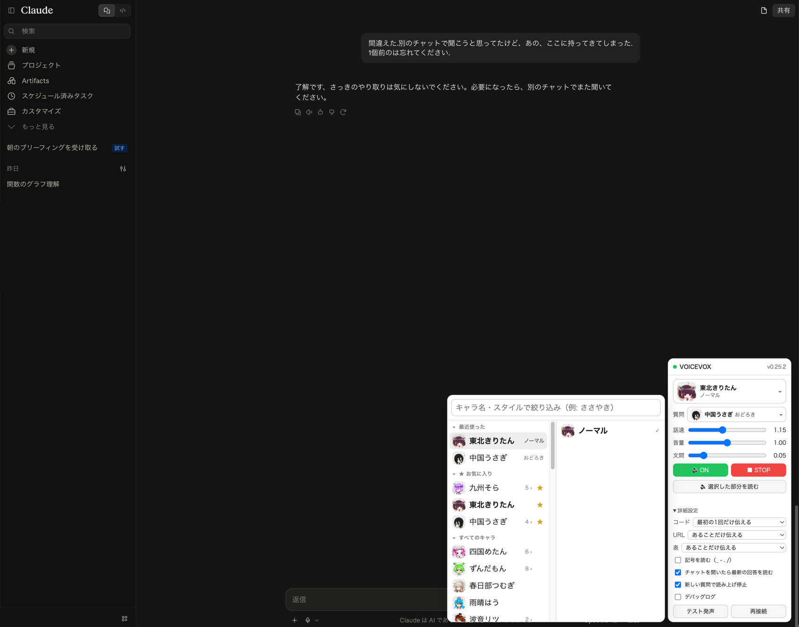

# Claude → VOICEVOX Bridge

Claude Web 版（claude.ai の通常チャット）の回答を、**生成の途中から VOICEVOX の好きなキャラクターの声で**読み上げる、Chrome 用の UserScript（Tampermonkey）です。



Claude を開くと右下にパネルが出ます。画像は、パネルの話者を押してメニューを開いたところです。

> **非公式ツールです。** Anthropic・VOICEVOX とは関係ありません。
> ChatGPT 用は別のプロジェクトです → [chatgpt-voicevox-bridge](https://github.com/mizumori-24522/chatgpt-voicevox-bridge)

## できること

- **回答が出始めた瞬間から読み上げ**：全文がそろうのを待たず、書かれた順に読みます
- **キャラクターとスタイルを顔アイコンで選べる**：最近使った5つと★お気に入りが一番上に並びます
- **自分の質問は別の声で読める**：回答と質問に違うキャラクターを割り当てられます
- **過去の発言を読み直せる**：発言にマウスを乗せると出る「🔊 この回答を読む」「🔊 この質問を読む」から。ドラッグで選んだ部分だけ読むこともできます
- **コード・表・URL は読み方を選べる**：「ここにコードがあります」と伝えるだけにする、など
- **会話を外部に送らない**：API キーは不要で、通信先は Claude 自身と手元の VOICEVOX だけです

## 導入

必要なものは、Chrome 系ブラウザ、[Tampermonkey](https://www.tampermonkey.net/)、[VOICEVOX](https://voicevox.hiroshiba.jp/)（アプリまたは Engine 単体）です。macOS で確認しています。

1. **VOICEVOX を起動する**
2. **Chrome に Tampermonkey を入れ**、`chrome://extensions` の「詳細」で **「ユーザー スクリプトを許可する」を ON** にする
3. **次の URL を Chrome で開き**、出てきた画面で「インストール」を押す

   ```
   https://raw.githubusercontent.com/mizumori-24522/claude-voicevox-bridge/main/dist/claude-voicevox.user.js
   ```

4. **https://claude.ai を開く**。右下のパネルの ● が緑になり、`v0.xx.x` と出れば接続成功です
5. 話者を選び、「詳細設定 → テスト発声」で音が出ることを確認する

あとは普段どおり質問するだけです。次回からは、VOICEVOX を起動してから Claude を開いてください。

- **更新**：新しい版は Tampermonkey が自動で取り込みます（既定で 1 日 1 回確認）。すぐ欲しいときは、Tampermonkey のダッシュボードの「ユーティリティ」→「インストール済みスクリプトの更新を確認」
- **対象**：通常のチャットだけです。claude.ai/code（Claude Code の Web 版）とデスクトップアプリ版では動きません
- **ChatGPT 用との併用**：両方入れても干渉しません。設定はサイトごとに別々に保存されます

## 使い方

### パネル

| 項目 | 内容 |
| --- | --- |
| ● | VOICEVOX との接続状態（緑=接続中 / 黄=試行中 / 灰=未接続）。見出しを押すとパネルを畳めます |
| 話者 | 回答を読む声 |
| 質問 | 自分の質問を読む声。選ばなければ回答と同じ声 |
| 話速 / 音量 / 文間 | 速さ、大きさ、文と文の間の無音の長さ（箇条書きの切り替わりの速さに効きます） |
| 🔊 ON / ■ STOP | 読み上げの有効・無効 / 今の読み上げを止める |
| 🔈 選択した部分を読む | ドラッグで選んだ範囲だけを読む |
| 詳細設定 | コード・URL・表の読み方、ファイル名の記号（`_ - . /`）を読むか、チャットを開いたら最新の回答を読むか、新しい質問で読み上げを止めるか、デバッグログ、テスト発声、再接続 |

### 話者を選ぶメニュー

「話者」または「質問」を押すと開きます。左のキャラクターにマウスを乗せると、右にスタイル（ノーマル・ささやき など）が出ます。上の欄に文字を入れると絞り込めます。

- **最近使った**：最近選んだ5つ。押すとその場で決定
- **★ お気に入り**：キャラクターの行の右端の ☆ を押すと、ここに固定されます
- **すべてのキャラ**：それ以外の全員。見出しを押すと畳めるので、畳んでおけばよく使う話者だけが並びます

### 過去の発言を読む

- 回答にマウスを乗せると、回答の左上に **「🔊 この回答を読む」** が出ます
- 自分の質問にマウスを乗せると、吹き出しの右上に **「🔊 この質問を読む」** が出ます

回答と質問に違うキャラクターを選んでおくと、どちらの発言かを声で聞き分けられます。

### 読み方を直したいとき

VOICEVOX 本体の **「読み方＆アクセント辞書」** がそのまま効きます。`NVIDIA → エヌビディア` のように登録すれば、次の読み上げから反映されます。

## 困ったとき

| 症状 | 対処 |
| --- | --- |
| ● が灰色（未接続） | VOICEVOX を起動してから、詳細設定の「再接続」 |
| 「再生がブロックされました」 | ページを一度クリックしてから質問し直す（ブラウザの自動再生制限のため） |
| 読み上げが始まらない | パネルが 🔊 ON か確認する |
| パネルが出ない | Tampermonkey でスクリプトが有効か確認する |
| 二重に読む・途中で止まる | 詳細設定の「デバッグログ」を ON にし、Console の `[Observer]` のログを添えて [Issues](https://github.com/mizumori-24522/claude-voicevox-bridge/issues) へ |

## プライバシー

通信先は Claude Web 自身と、手元の VOICEVOX（`127.0.0.1:50021`）だけです。解析・ログ送信・読み上げた文章の保存はしません。設定はブラウザの `localStorage`（キー `cvb.settings.v2`）に入ります。

## 開発者向け

```bash
npm install
npm test            # 単体テスト（vitest）
npm run typecheck
npm run build       # dist/claude-voicevox.user.js を作る
npm run release     # テスト → 版上げ（0.2.0 → 0.3.0）→ ビルド
npm run release:patch   # 修正だけのとき（0.2.0 → 0.2.1）
```

Tampermonkey は `@version` が上がったときだけ更新を取り込みます。配るときは `release` のあと、`dist/` ごとコミットして push します。

<details>
<summary>モジュールの役割</summary>

| モジュール | 役割 |
| --- | --- |
| `claude-adapter.ts` | Claude（claude.ai）の DOM 依存を全部ここへ隔離。UI 変更時はここだけ直す |
| `observer.ts` | MutationObserver + 200ms ポーリング。mutation を直接 TTS へ流さない |
| `text-diff.ts` | 「消費済み文字数」を持ち、再描画されても同じ文章を二度読まない |
| `chunker.ts` | `。！？` と改行を境界に、35〜180 文字の自然な単位へ切り出す |
| `speech-sanitizer.ts` | DOM 構造を根拠に、コード・表・URL・出典・検索や思考の表示を処理 |
| `voicevox-client.ts` | `/version` `/speakers` `/audio_query` `/synthesis` |
| `playback-queue.ts` | 合成と再生を分け、喋りながら次を先読み合成する。チャンクごとに話者を指定できる |
| `ui.ts` | Shadow DOM のフローティングパネル（Claude の CSS と干渉しない） |
| `voice-picker.ts` | キャラクター → スタイルの2段メニュー |
| `icon-cache.ts` | 顔アイコンを必要な分だけ取り、同じものは二度取らない |
| `message-actions.ts` | 各回答・各質問へ読み上げボタンを差し込む |

</details>

<details>
<summary>読み上げの細かい挙動</summary>

- Markdown をテキストとして解釈するのではなく、Claude が描画済みの DOM（`<pre>` `<table>` `<a>` など）を見て判定する。生成途中の未閉じコードフェンスに強い。
- 再生中に次のチャンクを先読み合成する（2つ先まで）。再生は常に1本だけで、音声は重ならない。
- チャンク前後の無音は VOICEVOX の既定より短くしてある（`prePhonemeLength=0.0` / `postPhonemeLength=0.05` / `pauseLengthScale=0.9`）。パネルの「文間」は `postPhonemeLength`。
- コードブロックは、罫線で描いた図なら「ここに図があります」、そうでなければ「ここにコードがあります」。既定では1つの回答につき最初の1回だけ知らせる。
- 絵文字は読み上げ前に取り除く。
- 生成中の判定は停止ボタンに依存しきらない。本文の増加が 1.2 秒止まったら完了とみなして残りを読む。
- 開き直しただけの回答は逐次読み上げしない。会話が仮想化されていて、出現だけでは新規と区別できないため、次のいずれかを観測したときだけ読む：送信操作（Enter / 送信ボタン。変換確定の Enter は除く）、同じ会話の中で質問が増えた、生成中。
- 読み上げボタンは発言の上の空きに出す（回答は左上、質問は右上）。本文の1行目や Claude 自身のボタン列と重ならないようにするため。

</details>

<details>
<summary>実測した Claude の DOM（2026-10-03）</summary>

```html
<div data-testid="transcript-row" data-perf-row="human|assistant">   ← 仮想化される行
  <div data-cds="UserMessage"><div data-testid="user-message">…質問…</div></div>
  <div data-testid="assistant-message" data-turn-key="<uuid>-hub-reply"
       data-is-streaming="true|false">
    <h2 class="sr-only">Claudeが返答しました: …</h2>
    <div>
      <div data-cds="TurnStatus">ウェブを検索しました</div>            ← 読まない
      <div data-transcript-engine-root>
        <div data-cds="Prose"><div data-perf-reply-text>…本文…</div></div>
    <div><div data-testid="message-actions">…</div></div>              ← 読まない
```

- 回答の同一性は `data-turn-key`（生成の最初から最後まで変わらない）。質問は本文で同一性を見る
- 送信直後は回答の枠だけが現れ、`data-is-streaming` も本文もまだ無い。生成中の判定は停止ボタン `[data-testid="chat-input-stop"]` と `data-is-streaming="true"` の両方を見る
- 入力欄は `[data-testid="chat-input"]`、送信ボタンは `[data-testid="chat-input-send"]`
- 会話の URL は `/chat/<uuid>`。新規チャット（`/new`）は、送信した瞬間に `/chat/<uuid>` へ変わる
- Web 検索の出典チップは `span[data-not-prose]`、コード枠は `div[role="group"]`（言語名のラベル付き）。出典と言語名は読まない

</details>

<details>
<summary>VOICEVOX との通信</summary>

`https://claude.ai` から `http://127.0.0.1:50021` への直接の `fetch` や `` は、CORS / Private Network Access で止まることがある。そのため通信は Tampermonkey の `GM_xmlhttpRequest` 経由で行い、許可する先は `@connect 127.0.0.1` と `@connect localhost` だけにしている。

顔アイコンは `/speaker_info` を `resource_format=url` で呼んで URL だけ受け取り、表示するものだけバイト列で取って `blob:` URL にしている（既定のままだと、サンプル音声まで同梱されて 1 キャラ 5MB を超える）。

</details>

<details>
<summary>ビルドのたびに入れ直したくない場合</summary>

Tampermonkey のスクリプトを殻だけにして、手元のビルド成果物を直接読ませます。`chrome://extensions` の Tampermonkey で **「ファイルの URL へのアクセスを許可する」を ON** にすると、以後は `npm run build` してページを再読み込みするだけで反映されます。

```js
// ==UserScript==
// @name         Claude → VOICEVOX Bridge (dev)
// @match        https://claude.ai/*
// @connect      127.0.0.1
// @connect      localhost
// @grant        GM_xmlhttpRequest
// @require      file:///Users/<ユーザー名>/claude-voicevox-bridge/dist/claude-voicevox.user.js
// ==/UserScript==
```

</details>

## クレジット

- 音声合成：[VOICEVOX](https://voicevox.hiroshiba.jp/)
- 読み上げ・話者メニューなどの土台は [chatgpt-voicevox-bridge](https://github.com/mizumori-24522/chatgpt-voicevox-bridge) と共通です
- 画像に写っているキャラクター（VOICEVOX:東北きりたん、VOICEVOX:中国うさぎ ほか）の画像・音声の権利は、それぞれの権利者に帰属します。読み上げた音声を公開・配布するときは、各キャラクターの利用規約に従ってクレジットを表記してください。
